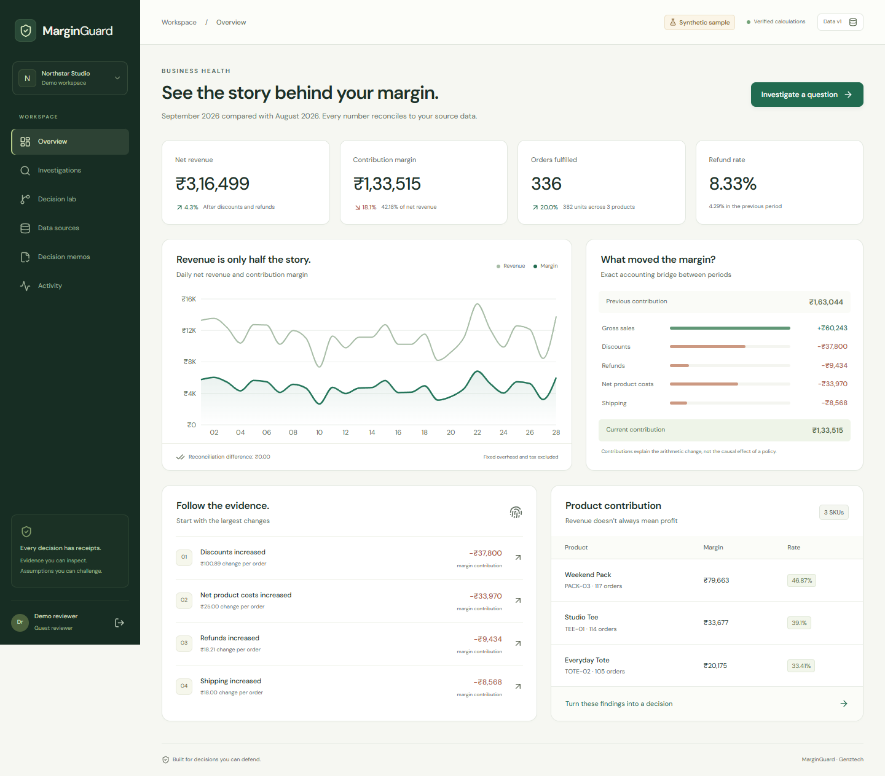

# MarginGuard

### Turn margin questions into decisions you can defend.

[](https://github.com/eeshwar369/MarginGuard/actions/workflows/ci.yml)

MarginGuard is an evidence-backed AI decision engine for retail profitability. It reconciles orders, refunds, and fulfilment costs, investigates margin erosion, and helps operators compare actions before approving a decision. Every finding connects to the records, calculations, and assumptions behind it.

**[Launch MarginGuard →](https://marginguard-genztech.onrender.com)** · [Product walkthrough](#try-the-complete-workflow) · [Architecture](docs/ARCHITECTURE.md) · [Verification evidence](docs/VERIFICATION.md)

> The live app runs on Render Free with persistent Neon PostgreSQL storage. Its first load after inactivity can take around a minute. Choose **Explore the live workspace** for a private synthetic demo, or **Create your workspace** to register an account.



## From business data to an approved decision

In the synthetic sample, revenue rises **4.3%** while contribution falls **18.1%**. MarginGuard lets an operator inspect the causes, challenge an explanation, and see which action holds up when assumptions change.

| Capability | What the operator can do |
|---|---|
| **Reconciled business data** | Import three CSVs, inspect an exact financial ledger, quarantine duplicate refunds, and resolve missing costs or conflicting records before analysis. |
| **Evidence-linked investigations** | Ask a business question, inspect a saved investigation, and distinguish supported, contradicted, and unresolved hypotheses. |
| **Source-level traceability** | Follow a finding to its formula, SQL, source rows, and file fingerprints; correct a cost with a recorded reason and a new data version. |
| **Decision stress-testing** | Compare discount changes, shipping savings, and the current policy across demand and return-cost bounds, implementation costs, break-even points, and downside outcomes. |
| **Versioned approvals** | Review and approve a decision against exact inputs, export PDF or JSON, and retain the history when changed inputs make an approval stale. |
| **Persistent private workspaces** | Keep accounts, datasets, investigations, and decisions in PostgreSQL across application restarts, with session protection, workspace isolation, and audit history. |

### How AI fits into the workflow

LangGraph coordinates **Validate → Plan → Investigate → Verify**, with persisted checkpoints for interrupted runs. With consent, Gemini selects bounded, typed analyses using the question and numerical summaries. DuckDB and exact monetary arithmetic calculate the results; the model does not generate executable SQL or financial values.

The interface identifies deterministic mode and provider-failure fallback explicitly. A real Gemini investigation has been verified on the deployed service; [the verification record](docs/VERIFICATION.md) separates live-provider evidence from deterministic and mocked-provider checks.

## Try the complete workflow

1. [Open the live app](https://marginguard-genztech.onrender.com) and select **Explore the live workspace**. Each visitor receives a separate demo workspace.
2. Inspect **Discounts increased** from Overview. Follow the formula and source rows.
3. Open Investigations and ask **“Did discounts decrease?”**. Consent to AI planning, or turn it off to use deterministic mode. The sample evidence contradicts the hypothesis.
4. In Decision lab, change maximum extra return cost per order from **₹4 to ₹20**. The recommendation changes from shipping savings to keeping the current policy.
5. Restore ₹4, create a memo, review its assumptions, approve, and download the PDF.
6. Correct a cost in Evidence explorer. The data version changes and the earlier memo becomes **stale** while its history remains available.
7. In Data sources, load the quality challenge. A duplicate refund is quarantined; investigations and scenarios remain blocked until acknowledgement.

Demo accounts are temporary. Register through **Create your workspace** to retain your own workspace. **Sign out** stays at the bottom of the navigation sidebar; on mobile, open the menu first.

All sample business data is synthetic. Scenario outcomes depend on explicit assumptions and do not establish realized savings or causal demand effects.

## Verified behavior

| Check | Observed result |
|---|---|
| Backend contracts | The same **54 tests passed on SQLite and PostgreSQL 17**. |
| Complete browser workflows | **Three Playwright journeys passed against the public deployment**, including evidence, approvals, corrections, quality gates, and mobile navigation. |
| Live AI integration | A Gemini investigation completed in AI mode and correctly contradicted the sample discount hypothesis. |
| Durable storage | A registered account, dataset, and approved memo survived application redeployment; PDF export remained available. |
| Automated accessibility | No violations detected on the three scanned screens. |

See [verification results and their limits](docs/VERIFICATION.md) and [portable evidence](docs/verification/). The [CI workflow](.github/workflows/ci.yml) builds the frontend, checks the backend against both databases, exercises browser journeys, and runs accessibility checks. These are functional checks, not a claim of unlimited capacity or an independent security certification.

## Architecture

| Layer | Technology | Responsibility |
|---|---|---|
| Interface | Next.js, React, TypeScript, Recharts | Exported client served from the application |
| API | FastAPI, Pydantic | Authenticated contracts and transactional workflows |
| Analytics | DuckDB, integer paise | Reconciliation and exact accounting attribution |
| Investigation | LangGraph, optional Google Gemini | Bounded planning with durable stage checkpoints |
| Scenarios | Python Decimal | Whole-order sensitivity and downside comparisons |
| Persistence | PostgreSQL in the cloud; SQLite WAL locally | Accounts, snapshots, runs, memos, audit |
| Reports | ReportLab | Downloadable decision PDF |
| Verification | pytest, Playwright, Ruff, TypeScript | Financial, security, workflow, and browser checks |

The static frontend and FastAPI API run as one Docker service. Controls include scrypt password hashing, HttpOnly sessions, CSRF and origin protection, workspace isolation, production CSP, bounded uploads and job queues, rate limits, and transactional approval checks. Read the [architecture guide](docs/ARCHITECTURE.md) for the data model and recovery behavior.

## Run locally

Use Python 3.12, Node.js 22, and [uv](https://docs.astral.sh/uv/). Dependencies are locked in `uv.lock` and `web/package-lock.json`.

```sh
uv sync --frozen
cd web
npm ci
npm run build
cd ..
uv run uvicorn app.main:app --host 127.0.0.1 --port 8000
```

Open **http://127.0.0.1:8000**. Local development defaults to SQLite, and the deterministic workflows need no AI key. To enable Gemini, create a local `.env` from [`.env.example`](.env.example), set `MG_GEMINI_API_KEY`, and restart. Keep credentials out of Git.

### Run the checks

```sh
uv run ruff check app tests scripts
uv run pytest -q
uv run python -m scripts.benchmark
cd web
npx playwright install chromium
npm run test:e2e
```

Browser checks require a built frontend and running app. Use `MG_TEST_URL` to select another deployment and `MG_BROWSER_PATH` to select an installed Chrome executable. [Verification documentation](docs/VERIFICATION.md) explains the fixtures, measurements, and PostgreSQL checks.

## Deploy with persistent storage

[Deploy on Render](https://render.com/deploy?repo=https://github.com/eeshwar369/MarginGuard) using the included Free blueprint and a separate [Neon PostgreSQL](https://console.neon.tech/signup) database. Set `MG_DATABASE_URL` and, for AI planning, `MG_GEMINI_API_KEY` in Render's private environment. The app uses its assigned HTTPS origin automatically.

PostgreSQL keeps accounts, datasets, checkpoints, and decisions across Render restarts. Free hosting has cold starts and usage quotas. The [deployment guide](docs/DEPLOYMENT.md) covers configuration, persistence checks, and operational limits; the [CSV contract](docs/CSV_CONTRACT.md) documents imports.

The supported deployment uses one application process. Horizontal scaling, SSO, separate approver roles, password reset, and direct store integrations are outside this release.

## Built by Genztech

Created for **Build Fast with AI: AI Build Challenge 2026**, addressing **PS-04: AI Decision Engine for Business Data**.

**Baleeshwar Palavadi** — team leader and member · [LinkedIn](https://www.linkedin.com/in/eeshwar369/)

**[Try MarginGuard live](https://marginguard-genztech.onrender.com)** · [Explore the source](https://github.com/eeshwar369/MarginGuard)
