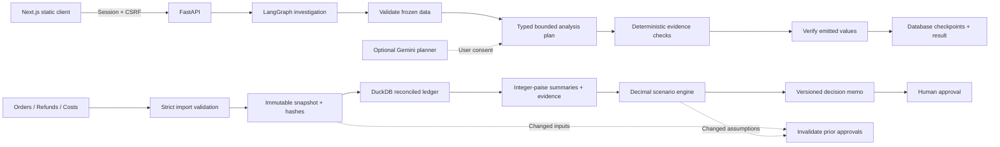

# How MarginGuard makes a decision inspectable

## Data contract

Amounts arrive as INR decimal strings with at most two decimal places and become integer paise before arithmetic. There is no mixed-currency conversion. Discounts, product costs, and shipping costs are **line totals**, not unit amounts. Quantities multiply unit prices only. Partial refunds aggregate by line before joins, preventing cost duplication. Recovered cost reduces product cost. Refunds are attributed to the original order month; this is a contribution analysis of order cohorts, not cash-flow accounting. Fixed overhead, tax, marketing costs, and payment fees are outside the schema.

Each upload contains the three documented CSV schemas. Missing joins, conflicting keys, excessive refunds, and order-date contradictions block analysis. An identical repeated refund is quarantined and requires explicit acknowledgement. Quarantine retains the original source hash and row issue; normalized CSV exports contain only retained records. Every cost correction adds before/after values and a reason to a new snapshot. Original file hashes identify the uploaded sources, while the data-version hash also includes corrections. Old snapshots remain available.

## Investigation behavior

The graph has four actual execution stages: validate, plan, investigate, verify. The configured database stores a checkpoint after every completed stage. An interrupted run restarts the graph, skips completed stages, and uses its original frozen dataset. This is a custom durable checkpoint layer around LangGraph, not a claim of distributed exactly-once execution. The optional model call may repeat if the process crashes after the provider returns but before the checkpoint commits.

Gemini receives only the question and numerical period summaries after user consent. It selects up to five typed metrics and a claimed direction; it cannot produce SQL, read arbitrary files, change data, approve decisions, or invent displayed financial values. The model output is schema-validated. Evidence and hypothesis status come from stored numerical calculations. AI failure is visibly labeled as deterministic fallback. Without a configured key the UI explicitly says verified analysis. Deterministic question matching is a limited keyword router, not semantic AI.

## Decision model

Discount option: whole retained orders × (baseline contribution per order + discount reduction), less implementation cost. Demand loss varies from zero to the entered maximum. Shipping option: baseline contribution + orders × (shipping saving − extra return cost), less implementation cost. Shipping volume is held fixed. Current policy is the third option. The recommendation maximizes minimum contribution within those specified bounds; it is not a forecast, probabilistic confidence interval, or causal estimate. Ties favor current policy. The chart uses 21 deterministic sensitivity points.

Data and scenario hashes bind every memo. A transaction compares them again at approval. Input changes mark prior records stale; previous approver and approval time remain in history. Reverting inputs creates a new draft and never revives an old approval. No price or fulfilment changes are executed.

## Deployment boundary

One FastAPI process serves the exported frontend and API. A two-thread executor processes up to twelve queued/running investigations across the service, one active run per workspace. PostgreSQL (Neon on the free Render deployment) stores accounts, sessions, snapshots, results, memos, and audit events. Local development uses SQLite WAL when no `MG_DATABASE_URL` is configured. Critical read/modify/write transactions use a PostgreSQL transaction-scoped advisory lock or SQLite `BEGIN IMMEDIATE`; both serialize the approval/version checks. PostgreSQL uses a bounded five-connection pool, short idle retention, TLS in production, parameter binding, and statement/lock timeouts. The app refuses to start on Render without an external database URL, preventing accidental ephemeral storage. DuckDB is an in-memory per-request analytical engine; it is not the primary datastore. This release is a **single-instance** product. Horizontal deployment still needs a distributed job queue and coordinated restart recovery; adding PostgreSQL alone does not make the in-process investigation executor safe for multiple replicas.

Sessions are HTTP-only cookies; production requires HTTPS and secure cookies. Unsafe requests require the expected origin and an authenticated CSRF token. Passwords are scrypt hashes. Workspace ownership is checked on resource access. Model secrets never enter the frontend bundle. API responses are non-cacheable; production sends CSP and other security headers. Application audit records are append-only through the API, but they are not cryptographically tamper-proof against a database administrator.
